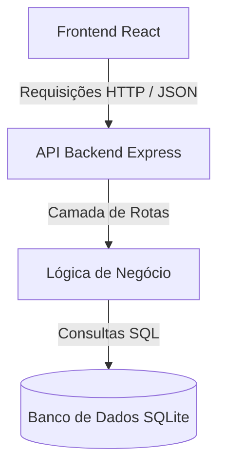

# Análise Arquitetural - ESM Forum

Este documento analisa a arquitetura atual do sistema ESM Forum.

## a) Identificação da Arquitetura

* **Estilo Arquitetural:** O sistema atual adota uma arquitetura em camadas simplificada e monolítica, dividida entre uma API backend em Node.js (Express) e uma interface frontend em React.

* **Camadas Existentes:**

  * **Apresentação:** Rotas do Express e componentes React no frontend.
  * **Negócio:** Lógica inserida diretamente nos manipuladores de rotas e scripts da aplicação.
  * **Dados:** Consultas diretas ao SQLite via driver nativo.

* **Comunicação:** O frontend e o backend se comunicam através de requisições HTTP assíncronas (API RESTful utilizando JSON).

## b) Diagrama Arquitetural

