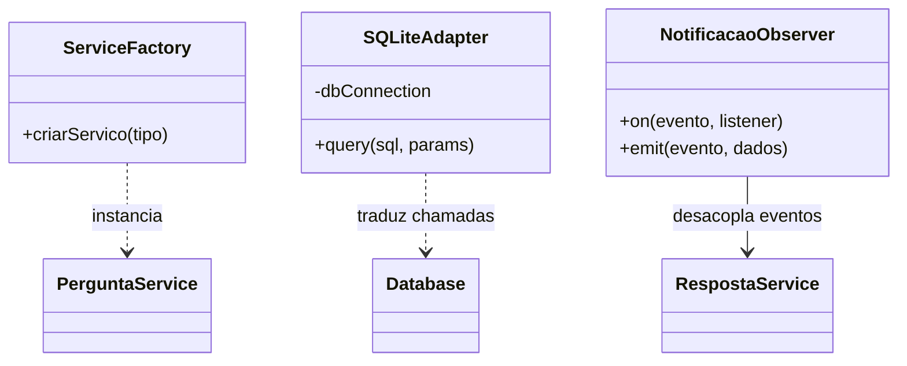

# Proposta de Aplicação de Padrões de Projeto - ESM Forum

Este documento propõe a aplicação de **3 padrões de projeto** para melhorar a manutenibilidade, flexibilidade e arquitetura do ESM Forum.

---

## 1. Padrão Criacional: Factory Method

### a) Justificativa e Contexto

* **Funcionalidade:** Criação de objetos de dados e instanciação de serviços no backend.
* **Problema que resolve:** Evita acoplamento forte e instanciação direta (`new`) espalhada pelo código de rotas.
* **Adequação:** Facilita a criação centralizada de controladores ou repositórios conforme o tipo de entidade requisitada.

### b) Proposta de Solução

Uma classe `ServiceFactory` centraliza a criação dos objetos de regras de negócio, injetando as dependências necessárias de forma automatizada.

### c) Exemplo de Código

```javascript
class ServiceFactory {
    static criarServico(tipo) {
        if (tipo === 'pergunta') {
            return new PerguntaService(new PerguntaRepository());
        }

        if (tipo === 'voto') {
            return new VotoService(new VotoRepository());
        }

        throw new Error('Serviço desconhecido');
    }
}
```

---

## 2. Padrão Estrutural: Adapter

### a) Justificativa e Contexto

* **Funcionalidade:** Camada de persistência (Banco de dados).
* **Problema que resolve:** Caso seja necessário trocar o driver do SQLite por outro banco relacional, como PostgreSQL ou MySQL, no futuro.
* **Adequação:** Isola a API do banco atual em um adaptador único, impedindo alterações em cascata por toda a aplicação.

### b) Proposta de Solução

Criar uma interface comum de banco de dados e um `SQLiteAdapter` que traduz os comandos para o driver específico utilizado.

### c) Exemplo de Código

```javascript
class SQLiteAdapter {
    constructor(dbConnection) {
        this.db = dbConnection;
    }

    async query(sql, params) {
        return new Promise((resolve, reject) => {
            this.db.all(sql, params, (err, rows) => {
                if (err) {
                    reject(err);
                } else {
                    resolve(rows);
                }
            });
        });
    }
}
```

---

## 3. Padrão Comportamental: Observer

### a) Justificativa e Contexto

* **Funcionalidade:** Sistema de notificação de novas respostas.
* **Problema que resolve:** Acoplamento rígido entre o cadastro de uma resposta e o envio de notificações ao autor da pergunta.
* **Adequação:** Permite que o autor seja notificado de forma desacoplada sempre que um evento de nova resposta for disparado.

### b) Proposta de Solução

Um gerenciador de eventos (`EventEmitter`) onde o serviço de respostas dispara o evento de "resposta criada" e os observadores (módulo de notificação/email) reagem de forma assíncrona.

### c) Exemplo de Código

```javascript
const EventEmitter = require('events');

class NotificacaoObserver extends EventEmitter {}

const notificacaoBus = new NotificacaoObserver();

notificacaoBus.on('respostaCriada', (perguntaId, autorId) => {
    console.log(
        `Enviando notificação para o usuário ${autorId} sobre a pergunta ${perguntaId}`
    );
});
```

---

## 4. Diagrama de Classes UML dos Padrões Propostos


