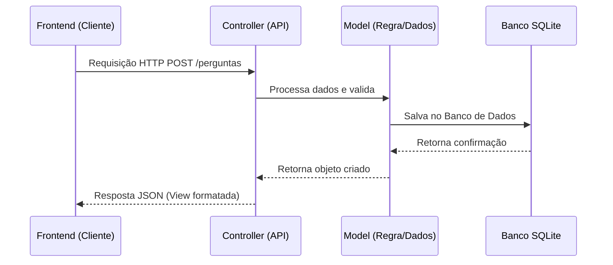

# Proposta de Organização Arquitetural e MVC - ESM Forum

Este documento propõe uma reestruturação arquitetural baseada em separação estrita de camadas e no padrão MVC para o backend.

## a) Proposta de Separação em Camadas

### 1. Camada de Apresentação (API Routes)

* **Responsabilidades:** Receber requisições HTTP, validar dados de entrada e retornar respostas JSON.
* **Exemplos:** `perguntasController.js`, rotas do Express.

### 2. Camada de Negócio (Services)

* **Responsabilidades:** Processar as regras da aplicação, como validação de votos e regras de tags.
* **Exemplos:** `perguntaService.js`, `votoService.js`.

### 3. Camada de Dados (Repositories / Models)

* **Responsabilidades:** Gerenciar a persistência e conexão direta com o banco de dados.
* **Exemplos:** `perguntaRepository.js`.

---

## b) Proposta de Aplicação do Padrão MVC

Para organizar o backend em funcionalidades como o sistema de perguntas e votos:

* **Models:** Modelam as entidades de dados e interagem com o banco, como `PerguntaModel`, estruturando colunas e queries.
* **Views:** Formatação das respostas padronizadas em formato JSON enviadas ao cliente.
* **Controllers:** Interceptam as requisições das rotas, acionam os modelos/serviços e devolvem a View.

### Diagrama de Fluxo MVC Proposto

